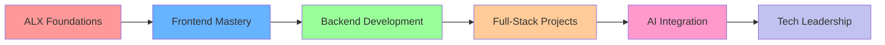

#  Alexander Nana Osei Agyeman

<div align="center">
  
[](https://git.io/typing-svg)

</div>


### 🚀 About Me

```javascript
const alexander = {
    location: "Accra, Ghana 🇬🇭",
    currentFocus: "ALX Software Engineering Program",
    mission: "Building tech solutions for African communities",
    passions: ["Youth Empowerment", "AgriTech", "Social Impact"],
    currentlyLearning: ["React.js", "Node.js", "AI/ML Integration"],
    funFact: "I code with a purpose - every line contributes to change!"
};
```

<br clear="right"/>

---

## 🎯 **Mission & Vision**

<table>
<tr>
<td width="50%">

### 💡 **Why I Code**
> *"Technology is only as powerful as the problems it solves and the lives it transforms."*

I'm passionate about leveraging technology to create **meaningful solutions** that drive positive change in African communities, empower youth, and build sustainable digital ecosystems.

</td>
<td width="50%">

### 🌍 **Impact Goals**
- **Youth Employment** → AI-powered job matching
- **Agricultural Growth** → Farmer-to-market platforms  
- **Community Empowerment** → Open-source social tools
- **Digital Inclusion** → Accessible web solutions

</td>
</tr>
</table>

---

## 🛠️ **Tech Arsenal**

<div align="center">

### **Frontend & Design**


### **Backend & Database**


### **Tools & Platforms**


</div>

---

## 📊 **GitHub Analytics**

<div align="center">
<table>
<tr>
<td width="50%">


</td>
<td width="50%">


</td>
</tr>
</table>


<br/>


</div>

---

## 🚀 **Featured Projects**

<div align="center">

<table>
<tr>
<td width="33%">

### 🌾 **AgriLink**


*Connecting Farmers to Markets*

Revolutionary platform linking Ghanaian farmers directly with urban buyers, featuring real-time inventory tracking and smart order management.

**Impact:** Reducing food waste & increasing farmer income

</td>
<td width="33%">

### 🤖 **JobBridge AI**


*AI-Powered Job Matching*

Smart platform matching African youth with verified opportunities using AI algorithms, mentorship features, and skill assessments.

**Impact:** Tackling youth unemployment at scale

</td>
<td width="33%">

### 📦 **OpenImpact**


*Tech for Social Good*

Curated collection of open-source projects focused on education, clean tech, and community tools for low-resource settings.

**Impact:** Democratizing technology access

</td>
</tr>
</table>

</div>

---

## 🎓 **Learning Journey**

<div align="center">



</div>

### 📚 **Current Focus Areas**
- **Advanced React Patterns** → Hooks, Context, Performance Optimization
- **Backend Architecture** → RESTful APIs, Database Design, Authentication
- **DevOps Essentials** → CI/CD, Deployment Strategies, Version Control
- **AI/ML Fundamentals** → Machine Learning Integration, Data Analysis

---

## 🏆 **Achievements & Recognition**

<div align="center">

| 🎯 **Milestone** | 📅 **Date** | 🏅 **Achievement** |
|:---:|:---:|:---:|
| **ALX Program** | 2024 | Selected for Software Engineering Cohort |
| **Community Impact** | Ongoing | Building solutions for local farmers |
| **Open Source** | 2024 | Contributing to social good projects |
| **Innovation** | 2024 | Developing AI-powered job platform |

</div>

---

## 🌐 **Connect & Collaborate**

<div align="center">

<a href="https://www.linkedin.com/in/xander-nana-osei-agyeman-58b330294">
  
</a>
<a href="mailto:alexandernanayawoseiagyeman@gmail.com">
  
</a>
<a href="https://alexosei.dev">
  
</a>
<a href="https://twitter.com/alexosei_dev">
  
</a>

<br/><br/>

### 💬 **Let's Build Something Amazing Together!**

> *"I'm always excited to collaborate on projects that create positive impact. Whether you're looking to solve social challenges through technology, need a passionate developer for your team, or want to discuss innovative ideas for African tech solutions – let's connect!"*

</div>

---

<div align="center">

### 💫 **Fun Stats**


<br/><br/>

*"The best way to predict the future is to build it."* **– Abraham Lincoln**

<br/>

**🌟 Thanks for visiting my profile! Don't forget to ⭐ star my repositories if you find them interesting!**

</div>

---

<div align="center">
  
</div>
